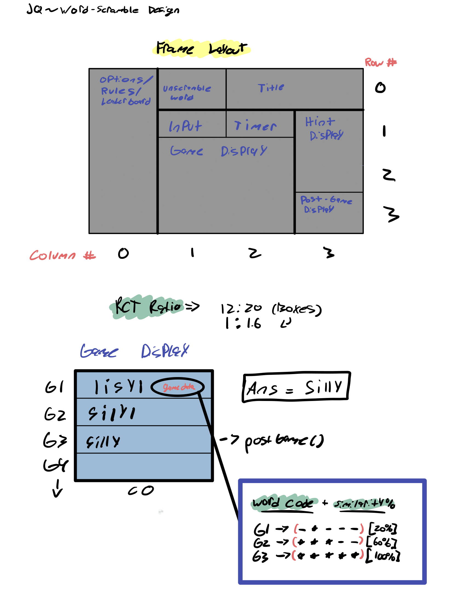

# Word Scramble Game

This Node.js backend server serves as the backend for a word unscrambling game. Players are challenged to unscramble words of varying lengths and earn high scores by solving them quickly and accurately.


## Demo
https://github.com/josephjquinn/ekreb-Word-Scramble/assets/81782398/4d153b30-139d-4516-b912-3fdc6e189cff
## Design Process


 


## Game Description:
Word Scramble is a word puzzle game that challenges players to unscramble words of varying lengths and test their vocabulary skills. With a combination of quick thinking and word knowledge, players can earn high scores.

## Rules:

Objective: The primary goal of the game is to unscramble the presented word and type it correctly.

### Gameplay:

Players start with an empty word display.
A scrambled word of varying lengths (3 to 6 letters) is presented on the screen.
Players need to unscramble the word by rearranging its letters to form the correct word.

### Word Validation:
After unscrambling the word, players type their guess in the input field provided.
The game validates the player's guess:
If the guess matches the original word, it's considered correct.
If the guess is incorrect, the game provides feedback, such as indicating correct and incorrect letter positions.
Players can make multiple attempts to guess the word correctly.

### Hints:
Players can request hints if they are stuck on a word. Hints may include:
Part of speech of the word.
The first letter of the word.
The definition of the word.
Using hints may affect the player's final score, so use them wisely.

### Scoring:
Players earn points based on various factors, including:
Word length: Longer words earn more points.
Time taken to solve the word: Faster solutions result in higher scores.
Correct guesses without hints: Players earn more points for guessing correctly without hints.

### Leaderboard:
The game maintains a leaderboard that displays the 10 highest scores achieved by players.
Players can compete to achieve the highest scores and see how they rank among other players.


### End of Round:
The game keeps track of completed rounds and provides statistics, including the percentage of rounds completed and round accuracy.
Players can choose to start a new round or exit the game.

## Features
- Word generation with scrambled words of varying lengths (3 to 6 letters).
- Word validation to check if player guesses match the original word.
- Hint system providing information about part of speech, starting letter, or word definition.
- High score leaderboard for competitive gameplay.
- API endpoints for interaction with the frontend.
- Score calculation based on word length, time taken, and hints used.

### To interact with the Word Scramble Game, you will need a frontend interface that communicates with this backend server through HTTP requests and responses. Ensure that the frontend is correctly configured to make requests to the server's API endpoints.

## API Endpoints
Here are the main API endpoints provided by this server:

- GET /session: Initialize game variables.
- POST /check-word: Validate player word guesses and provide feedback.
- POST /get-word: Generate scrambled words for players to unscramble.
- POST /accuracy: Calculate and return accuracy percentages for the game.
- GET /hint-1, GET /hint-2, GET /hint-3: Provide hints to players.
- GET /get-solution: Return the correct solution (for display purposes).
- GET /get-leaderboard: Retrieve the high score leaderboard.
- POST /update-leaderboard: Update the leaderboard with new scores and usernames.

### Installation
1. Clone this repository to your local machine:

   ```bash
   git clone https://github.com/yourusername/word-scramble-game.git
2. Navigate to the project directory.

   ```bash
   cd word-scramble-game
3. Navigate to api directory.

   ```bash
   cd backendAPI
3. Start API server.

   ```bash
   node index.js
4. Navigage to GUI directory.

   ```bash
   cd frontend
5. Start application.

   ```bash
   python3 main.py
